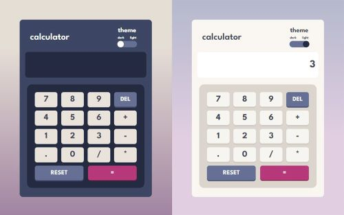

# Basic JavaScript Calculator

This is a simple calculator web application built using HTML, CSS, and JavaScript. It provides basic arithmetic calculations, including addition, subtraction, multiplication, and division, with support for floating-point numbers and negative numbers. The calculator also offers a light and dark mode.

## Usage

1. Launch the calculator by opening the `index.html` file in your web browser.
2. Use the on-screen buttons to input numbers and perform calculations.
3. To perform arithmetic operations:
    * Click the `+` button for addition.
    * Click the `-` button for subtraction.
    * Click the `*` button for multiplication.
    * Click the `/` button for division.    
5. To enter negative numbers, click the `-` button before the number.
6. To enter floating-point numbers, use the `.` button.
7. To clear the input or the current calculation, click the `RESET` button.
8. To delete last input number, click the `DEL` button.
9. To switch between light and dark modes, click the theme `toggle` button.

## License

This project is licensed under the MIT License.
